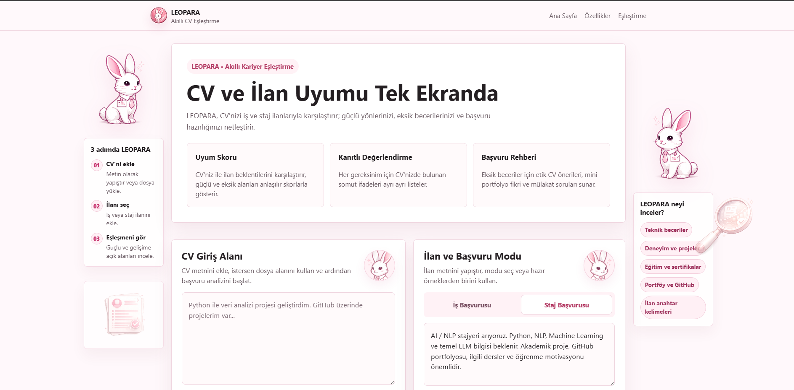
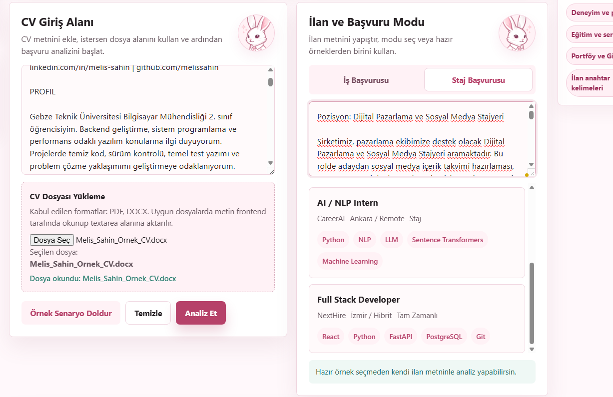
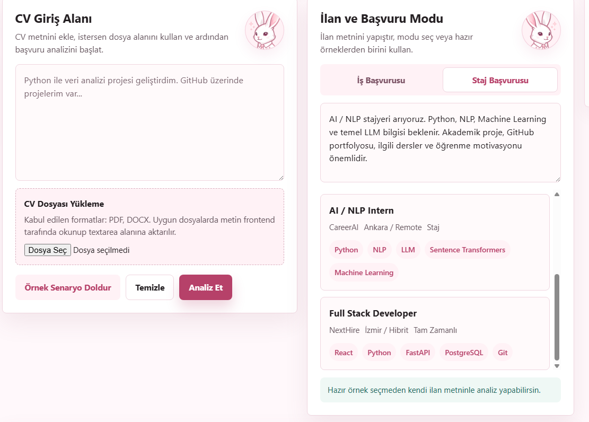
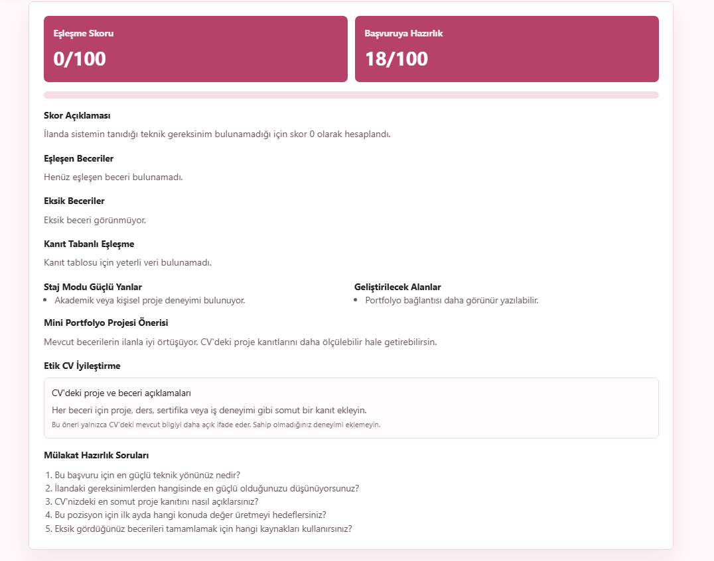
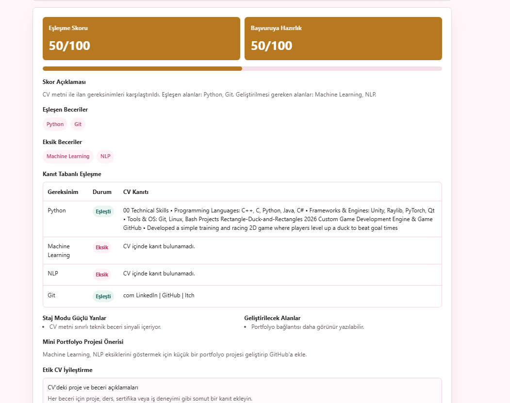

<p align="center">
  
</p>

<h1 align="center">Selam, ben LEOPARA</h1>

<p align="center">
  <strong>Akıllı CV ve İlan Eşleştirme</strong>
</p>

<p align="center">
  CV'ni iş veya staj ilanlarıyla karşılaştırır; güçlü yönlerini, eksik becerilerini ve başvuruya hazırlık durumunu anlaşılır şekilde gösteririm.
</p>

<p align="center">
  <a href="https://leopara.vercel.app"><strong>Canlı Demoyu Aç</strong></a> ·
  <a href="#çalışan-özellikler">Özellikler</a> ·
  <a href="#ürün-ekranları">Ürün Ekranları</a> ·
  <a href="#yerel-kurulum-ve-çalıştırma">Kurulum</a> ·
  <a href="#test-ve-doğrulama">Test</a> ·
  <a href="#teslim-dokümanları">Dokümanlar</a>
</p>

## Ürün özeti

LEOPARA, adayın CV'sindeki beceri ve kanıtları iş veya staj ilanının gereksinimleriyle karşılaştıran çalışan bir başvuru hazırlık ürünüdür. Amaç yalnızca bir yüzde üretmek değil; adayın hangi becerilerinin örtüştüğünü, neleri geliştirebileceğini ve CV'sini etik biçimde nasıl güçlendirebileceğini görünür kılmaktır.

- Canlı demo: [https://leopara.vercel.app](https://leopara.vercel.app)

## Takım

| Üye | Rol | Sorumluluk |
| --- | --- | --- |
| Yusuf Şengöz | Product Owner | Ürün vizyonu, backlog, kullanıcı hikayeleri ve demo akışı |
| Zeynep Özkan | Scrum Master & Teknik Destek | Sprint takibi, board, dokümantasyon, final test paketi, frontend canlıya alma süreci ve backend entegrasyon desteği |
| Ceren Aydın | Backend & AI/NLP | FastAPI, eşleştirme, skor ve backend testleri |
| Feyza Korkmaz | Frontend | React arayüzü, dosya yükleme ve sonuç ekranı |

Detay: [takım rolleri](docs/team_roles.md)

## Problem ve ürün değeri

İş ve staj başvurularında adaylar, CV'leri ile ilandaki beklentiler arasındaki farkı çoğu zaman net göremez. LEOPARA bu süreci daha anlaşılır hale getirir: CV ve ilan metninden beceri sinyallerini çıkarır, eşleşen ve eksik alanları karşılaştırır, ardından skorları kanıt tablosu ve gelişim önerileriyle birlikte sunar.

Bu sayede kullanıcı yalnızca “kaç puan aldığını” değil, skorun neden oluştuğunu ve başvuru öncesi hangi adımları güçlendirebileceğini görür.

## Nasıl çalışır?

| Adım | Açıklama |
| --- | --- |
| 1. CV'ni ekle | CV metnini yapıştır veya PDF/DOCX dosyası yükle. |
| 2. İlanı seç | İş ya da staj ilanını hazır örneklerden seç veya kendi ilan metnini gir. |
| 3. Analizi incele | Eşleşme skorunu, başvuruya hazırlık skorunu, kanıtları ve önerileri tek ekranda görüntüle. |

## Hedef kitle

- İş arayanlar ve yeni mezunlar
- Staj başvurusu yapan öğrenciler
- Kariyer değişikliği yapan adaylar
- Aday-pozisyon uyumunu ön değerlendirmek isteyen İK ekipleri

## Çalışan özellikler

- CV metni girişi ve PDF/DOCX dosyasından metin çıkarma
- İş veya staj ilanı metni girişi ile örnek veri seçimi
- İş Başvurusu ve Staj Başvurusu modu
- Eşleşme skoru ve başvuruya hazırlık skoru
- Skor açıklaması, eşleşen/eksik beceriler ve kanıt tablosu
- Staj moduna özel değerlendirme
- Mini portfolyo projesi, etik CV geliştirme ve mülakat soruları
- Uyumsuz CV ve ilan eşleşmelerinde analizi durduran uygunluk kontrolü
- Backend erişilemediğinde demo akışını koruyan istemci tarafı analiz yedeği

## Ürün ekranları

<table>
  <tr>
    <td width="33%">
      
      <br />
      <sub>Ana ekran ve ürün yerleşimi</sub>
    </td>
    <td width="33%">
      
      <br />
      <sub>CV ve ilan giriş alanları</sub>
    </td>
    <td width="33%">
      
      <br />
      <sub>Örnek senaryo görünümü</sub>
    </td>
  </tr>
  <tr>
    <td width="33%">
      
      <br />
      <sub>Geniş ekran arayüz</sub>
    </td>
    <td width="33%">
      
      <br />
      <sub>Uyumsuz başvuru analizi</sub>
    </td>
    <td width="33%">
      
      <br />
      <sub>Kısmi uyum analizi</sub>
    </td>
  </tr>
</table>

Sprint 2 teslim panosu: [SVG görsel](docs/assets/sprint2_board_snapshot.svg). Ürün ekranları ve sprint çıktıları repo içinde incelenebilir şekilde eklenmiştir.

## Teknolojiler

- Frontend: React, Vite, Axios, Mammoth, PDF.js
- Backend: Python, FastAPI, Pydantic, Uvicorn
- Eşleştirme: kural tabanlı anahtar kelime/beceri çıkarımı

## Yerel kurulum ve çalıştırma

Ön koşullar: Node.js 18+ ve Python 3.10+.

### Backend

`backend/app.py`, frontend'in kullandığı gerçek analiz API giriş noktasıdır. API `POST /analyze` ve `GET /health` uçlarını sunar.

```bash
cd backend
python3 -m pip install -r requirements.txt
python3 -m uvicorn app:app --reload
```

Backend varsayılan olarak `http://127.0.0.1:8000` adresinde çalışır.

### Frontend

Proje kök dizininde:

```bash
npm install
npm run dev
```

Frontend varsayılan olarak `http://localhost:5173` adresinde çalışır. Farklı bir backend adresi için `.env` içinde `VITE_API_URL` tanımlanabilir.

## API örneği

```http
POST /analyze
Content-Type: application/json
```

```json
{
  "cv_text": "Python ile veri analizi projesi geliştirdim.",
  "posting_text": "Python, SQL ve Machine Learning bilen stajyer aranıyor.",
  "application_type": "internship"
}
```

Yanıt; `match_score`, `readiness_score`, `score_explanation`, eşleşen/eksik beceriler ve kanıt tablosu gibi alanları içerir.

## Kısa demo akışı

1. CV metnini yapıştırın veya PDF/DOCX dosyası yükleyin.
2. İş/staj ilanı metnini girin ve başvuru türünü seçin.
3. **Analiz Et** akışını başlatın.
4. Skorları, neden oluştuğunu, kanıtları ve eksik becerileri inceleyin.
5. Portfolyo, etik CV ve mülakat önerileriyle sonraki adımı belirleyin.

Tekrarlanabilir iki ayrıntılı senaryo: [final demo senaryoları](sprint-3/demo_scenarios.md).

## Teslim dokümanları

- [Ürün vizyonu](docs/product_vision.md), [backlog](docs/product_backlog.md), [özgünlük noktaları](docs/originality_points.md), [AI mimarisi](docs/ai_architecture.md)
- [Sprint 1 teslim özeti](sprint-1/README.md), [Sprint 1 planı](sprint-1/sprint_planning.md), [Sprint 1 ürün durumu](sprint-1/product_status.md), [Sprint 1 review](sprint-1/sprint_review.md), [Sprint 1 retrospective](sprint-1/sprint_retrospective.md)
- [Sprint 2 teslim özeti](sprint-2/README.md), [Sprint 2 planı](sprint-2/sprint_planning.md), [Sprint 2 ürün durumu](sprint-2/product_status.md), [Sprint 2 review](sprint-2/sprint_review.md), [Sprint 2 retrospective](sprint-2/sprint_retrospective.md)
- [Final teslim özeti](sprint-3/README.md), [final ürün durumu](sprint-3/final_product_status.md), [final review](sprint-3/final_review.md), [final retrospective](sprint-3/final_retrospective.md), [final test sonuçları](sprint-3/final_test_results.md)

## Test ve doğrulama

- Backend birim testleri: `cd backend && python3 -m unittest discover -s tests`
- Frontend production build: `npm run build`
- Son doğrulama sonuçları: [final test sonuçları](sprint-3/final_test_results.md)
- Deployment planı ve ortam notları: [deployment notu](docs/deployment-options.md)

## Teknik kapsam ve sonraki geliştirmeler

Bu sürümde eşleştirme açıklanabilir kural tabanlı beceri çıkarımıyla yapılır. Taranmış PDF'ler için OCR, kullanıcı hesabı, analiz geçmişi, PostgreSQL kalıcı veri katmanı ve LLM/embedding tabanlı anlamsal eşleştirme sonraki geliştirme alanlarıdır. Açık işler ve öncelikleri [ürün backlog](docs/product_backlog.md) içinde görünür tutulur.
